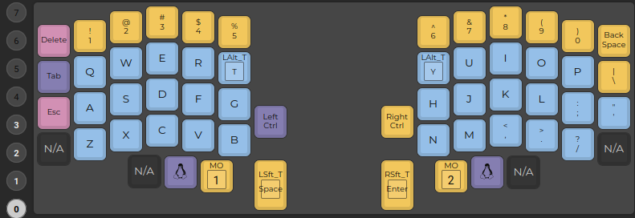
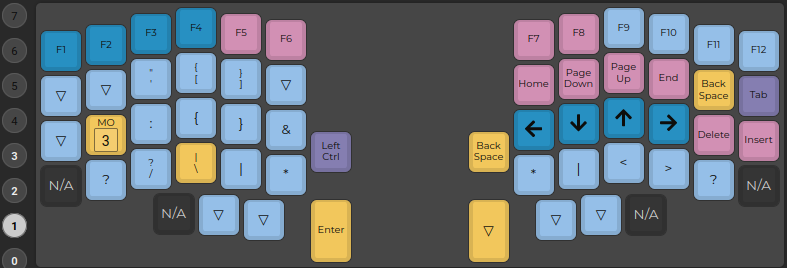
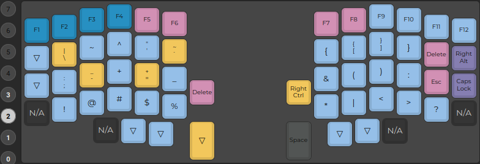
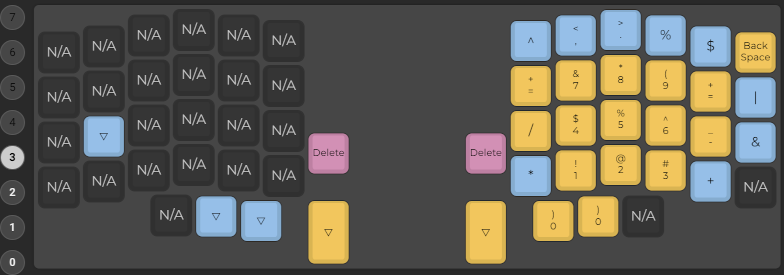

# Lily58pro

Lily58 Keyboard layout and configuration.

- Online Configurator [https://config.qmk.fm](https://config.qmk.fm)
  - Upload a QMK keymap JSON file: `lily58_glow_enc_layout_mine.json`
  - Colors: DSA Galaxy Class
  - Improve the layout
  - Compile
  - Download the new JSON file: `lily58_glow_enc_layout_mine.json`
  - Download the Firmware: `*.hex`

- Flash with [`QMK Toolbox`](https://github.com/qmk/qmk_toolbox) 
  - MCU: `ATmega32U4`
  - Local file: `*.hex`
  - Select auto-flash
  - Press phisical reset button twice

[layer 0](0.png)

[layer 1](1.png)

[layer 2](2.png)

[layer 3](3.png)

## TODO

